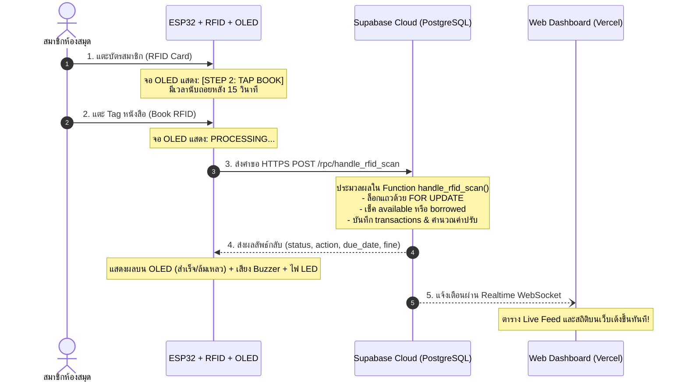

# 📚 Smart Library Borrowing System (Supabase + ESP32 RFID + OLED + Web Dashboard)

ระบบยืม-คืนหนังสือห้องสมุดอัจฉริยะแบบไร้เซิร์ฟเวอร์ (Serverless) ขับเคลื่อนด้วย **Supabase Cloud Database & Realtime** เต็มรูปแบบ รองรับการทำงานร่วมกับ **บอร์ด ESP32, เครื่องอ่าน RFID (RC522), จอแสดงผล OLED 0.96" (I2C SSD1306)** และ **หน้าเว็บมอนิเตอร์แบบสด (Web Dashboard)** ที่สามารถนำขึ้นโฮสติ้งฟรีบน **Vercel, Netlify หรือ GitHub Pages** ได้ทันที

---

## 📂 โครงสร้างโฟลเดอร์ของโปรเจกต์ (Project Directory Structure)

โปรเจกต์นี้ได้รับการจัดหมวดหมู่แยกตามหน้าที่อย่างเป็นระเบียบ สะอาดตา และมีคู่มือ `README.md` ประจำอยู่ทุกโฟลเดอร์เพื่อให้ผู้อื่นนำไปพัฒนาต่อได้ง่ายที่สุด:

```
├── 📁 01-supabase-backend/      👉 [สำหรับนำไปติดตั้งบนเซิร์ฟเวอร์ Supabase Cloud]
│   ├── README.md               - คู่มือการติดตั้ง Schema, RPC Function, RLS และการทดสอบ
│   ├── schema.sql              - สคริปต์ SQL สร้างตาราง, ดัชนี, ฟังก์ชัน handle_rfid_scan
│   └── seed_data.sql           - ข้อมูลตัวอย่างหนังสือ สมาชิก และบัตร RFID เริ่มต้น
│
├── 📁 02-esp32-firmware/        👉 [สำหรับแฟลชโค้ดลงบอร์ดไมโครคอนโทรลเลอร์ ESP32]
│   ├── README.md               - ผังวงจรการต่อขา, ตาราง Pinout, คู่มือ Arduino IDE & PlatformIO
│   ├── esp32_library_rfid_supabase.ino - โค้ดเฟิร์มแวร์หลัก (พร้อมคอมเมนต์ภาษาไทยทุกบรรทัด)
│   └── platformio.ini          - ไฟล์คอนฟิกและติดตั้งไลบรารีอัตโนมัติสำหรับ VSCode PlatformIO
│
├── 📁 03-web-dashboard/         👉 [สำหรับเปิดใช้งานหรือนำขึ้นโฮสติ้ง Vercel / Netlify]
│   ├── README.md               - คู่มือการใช้งานหน้าเว็บ, การเปิด Local และการปรับแต่งสไตล์
│   ├── index.html              - หน้า Dashboard (Tailwind CSS, Lucide Icons, Realtime Feed)
│   ├── app.js                  - ตรรกะฝั่ง JavaScript + Supabase JS Client v2 (Realtime WebSocket)
│   └── config.js               - ไฟล์สำหรับใส่ค่า URL และ API Key ของ Supabase
│
├── 📁 docs/                     👉 [เอกสารประกอบการติดตั้งและการต่อวงจรเชิงลึก]
│   ├── DEPLOYMENT_GUIDE.md     - คู่มือขึ้น Cloud แบบทีละสเต็ป (Supabase, GitHub, Vercel, Netlify)
│   └── HARDWARE_WIRING.md      - คู่มือวิศวกรรมฮาร์ดแวร์ การจัดการแรงดันไฟ 3.3V และบัส I2C/SPI
│
├── vercel.json                 - ไฟล์คอนฟิกพร้อม Deploy บน Vercel ได้ทันทีในคลิกเดียว
├── netlify.toml                - ไฟล์คอนฟิกสำหรับ Deploy บน Netlify
└── .gitignore                  - ไฟล์ตัดสิ่งที่ไม่จำเป็นออกจากระบบ Git
```

---

## ⚡ สรุปหน้าที่และการนำแต่ละส่วนไปใช้งาน

| โฟลเดอร์ | นำไปลงที่ไหน? | หน้าที่และอุปกรณ์ที่เกี่ยวข้อง |
|---|---|---|
| **`01-supabase-backend/`** | **Supabase Cloud** | นำไฟล์ `schema.sql` ไปรันในหน้า SQL Editor ของ Supabase เพื่อสร้างฐานข้อมูลและระบบจัดการตรรกะยืม-คืน |
| **`02-esp32-firmware/`** | **บอร์ด ESP32** | นำไฟล์ `.ino` ไปเปิดใน Arduino IDE แล้วแฟลชลงชิป ESP32 ที่ต่อกับ RC522 และจอ OLED 0.96" |
| **`03-web-dashboard/`** | **Vercel / Netlify / Browser** | ดับเบิลคลิกเปิดไฟล์ `index.html` หรือนำขึ้นโฮสติ้งฟรี เพื่อให้บรรณารักษ์มอนิเตอร์และจัดการหนังสือ |

---

## 🌟 จุดเด่นของระบบใหม่ (Serverless Architecture)

1. **Serverless 100%:** ไม่ต้องเปิดคอมพิวเตอร์ทิ้งไว้เพื่อรันเซิร์ฟเวอร์ Backend ตัวอุปกรณ์และหน้าเว็บต่อตรงกับ Supabase Cloud ได้ 24 ชั่วโมง
2. **Auto-Toggle ยืม-คืนอัตโนมัติ:** บอร์ดสแกนครั้งเดียว ระบบใน PostgreSQL จะตัดสินใจเอง:
   - ถ้าหนังสือว่าง $\rightarrow$ บันทึกการยืม + คำนวณวันส่งคืน
   - ถ้าหนังสือถูกยืมอยู่โดยคนเดิม $\rightarrow$ บันทึกการคืน + คำนวณค่าปรับล่าช้าอัตโนมัติ
3. **ป้องกัน Race Condition:** ใช้คำสั่ง `SELECT ... FOR UPDATE` ระดับฐานข้อมูล ป้องกันปัญหาแย่งกันยืมหนังสือเล่มเดียวกันในเสี้ยววินาที
4. **จอ OLED 0.96" (I2C SSD1306):** แสดงสถานะการสแกน 2 จังหวะ (แตะบัตร $\rightarrow$ แตะหนังสือ) พร้อมตัวเลขนับถอยหลัง 15 วินาที
5. **Realtime Web Dashboard:** อัปเดตรายการสแกนและตัวเลขสถิติบนหน้าเว็บทันทีแบบสดๆ ผ่าน WebSocket เมื่อมีการแตะบัตร

---

## ⚡ แผนภาพการทำงานของระบบ (Workflow Diagram)



---

## 🚀 เริ่มต้นใช้งานใน 3 ขั้นตอน (Quick Start)

### ขั้นที่ 1: ติดตั้งบน Supabase Cloud
1. สร้างโปรเจกต์ใหม่ที่ [https://supabase.com](https://supabase.com) (เลือก Region: Singapore)
2. ไปที่เมนู **SQL Editor** คัดลอกโค้ดจาก [`01-supabase-backend/schema.sql`](file:///Users/muaxzinn/Project/library-system-laravel-code%20%281%29/01-supabase-backend/schema.sql) ไปวางแล้วกด **Run**
3. รันโค้ดจาก [`01-supabase-backend/seed_data.sql`](file:///Users/muaxzinn/Project/library-system-laravel-code%20%281%29/01-supabase-backend/seed_data.sql) เพื่อใส่ข้อมูลตัวอย่าง
4. คัดลอก `Project URL` และ `anon key` จากเมนู **Project Settings $\rightarrow$ API**

### ขั้นที่ 2: แฟลชโค้ดลงบอร์ด ESP32
1. เปิดไฟล์ [`02-esp32-firmware/esp32_library_rfid_supabase.ino`](file:///Users/muaxzinn/Project/library-system-laravel-code%20%281%29/02-esp32-firmware/esp32_library_rfid_supabase.ino) ใน Arduino IDE
2. ใส่ชื่อ Wi-Fi, รหัสผ่าน, `SUPABASE_URL` และ `SUPABASE_KEY`
3. ต่อวงจรตามตารางใน [`02-esp32-firmware/README.md`](file:///Users/muaxzinn/Project/library-system-laravel-code%20%281%29/02-esp32-firmware/README.md):
   - จอ OLED (I2C): **SDA $\rightarrow$ GPIO 21, SCL $\rightarrow$ GPIO 22**
   - โมดูล RFID RC522 (SPI): **SCK $\rightarrow$ 18, MISO $\rightarrow$ 19, MOSI $\rightarrow$ 23, SDA $\rightarrow$ 5, RST $\rightarrow$ 4 (ย้ายหลบ I2C)**
4. อัปโหลดโค้ดลงบอร์ด ESP32

### ขั้นที่ 3: เปิดหน้าเว็บมอนิเตอร์และ Deploy
- **เปิดทดสอบในเครื่องทันที:** ดับเบิลคลิกเปิดไฟล์ [`03-web-dashboard/index.html`](file:///Users/muaxzinn/Project/library-system-laravel-code%20%281%29/03-web-dashboard/index.html) ในเบราว์เซอร์
- **นำขึ้น Cloud ฟรี:** อ่านขั้นตอนการนำขึ้น GitHub และโฮสต์บน **Vercel / Netlify** ได้ที่ไฟล์ [`docs/DEPLOYMENT_GUIDE.md`](file:///Users/muaxzinn/Project/library-system-laravel-code%20%281%29/docs/DEPLOYMENT_GUIDE.md)

---

## 📖 สารบัญเอกสารฉบับละเอียดในโปรเจกต์

* 🗄️ **คู่มือติดตั้งฝั่งฐานข้อมูล:** [`01-supabase-backend/README.md`](file:///Users/muaxzinn/Project/library-system-laravel-code%20%281%29/01-supabase-backend/README.md)
* 🔌 **คู่มือบอร์ด ESP32 และผังวงจร:** [`02-esp32-firmware/README.md`](file:///Users/muaxzinn/Project/library-system-laravel-code%20%281%29/02-esp32-firmware/README.md)
* 🌐 **คู่มือหน้าเว็บมอนิเตอร์ Dashboard:** [`03-web-dashboard/README.md`](file:///Users/muaxzinn/Project/library-system-laravel-code%20%281%29/03-web-dashboard/README.md)
* 🚀 **คู่มือการ Deploy ขึ้น GitHub, Vercel, Netlify:** [`docs/DEPLOYMENT_GUIDE.md`](file:///Users/muaxzinn/Project/library-system-laravel-code%20%281%29/docs/DEPLOYMENT_GUIDE.md)
* ⚡ **คู่มือวิศวกรรมฮาร์ดแวร์และการต่อสายลึก:** [`docs/HARDWARE_WIRING.md`](file:///Users/muaxzinn/Project/library-system-laravel-code%20%281%29/docs/HARDWARE_WIRING.md)
